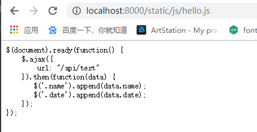
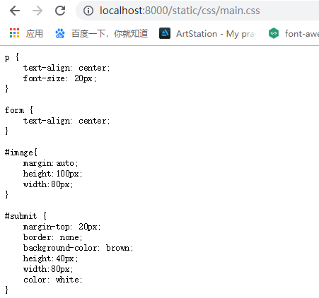
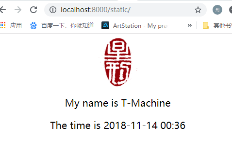
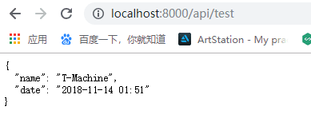
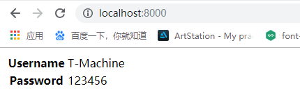
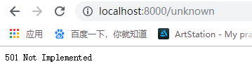

# cloudgo-io
**实现的功能：**

- 支持静态文件服务
- 支持简单的js访问
- 模板输出
- 提交表单，并输出一个表格
- 对`/unknown`给出开发中的提示


### 运行结果：

```
$go run main.go
```


`/static/`访问静态文件：





显示静态文件中的`index.html`页面：



js中访问的url`/api/test/`：



html模板的输出：


提交表单后显示表格：



对`/unknown`给出开发中的提示：


